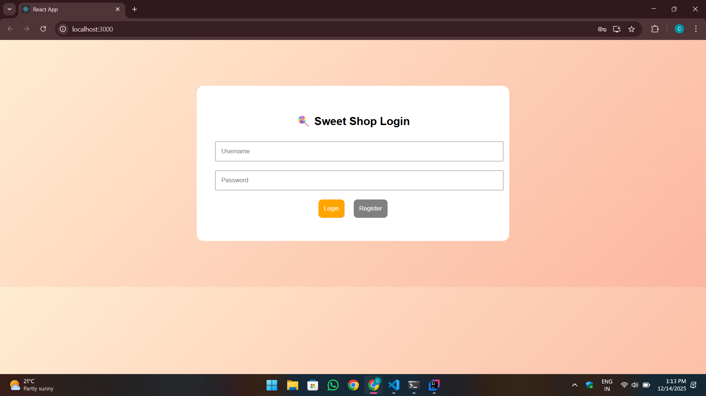
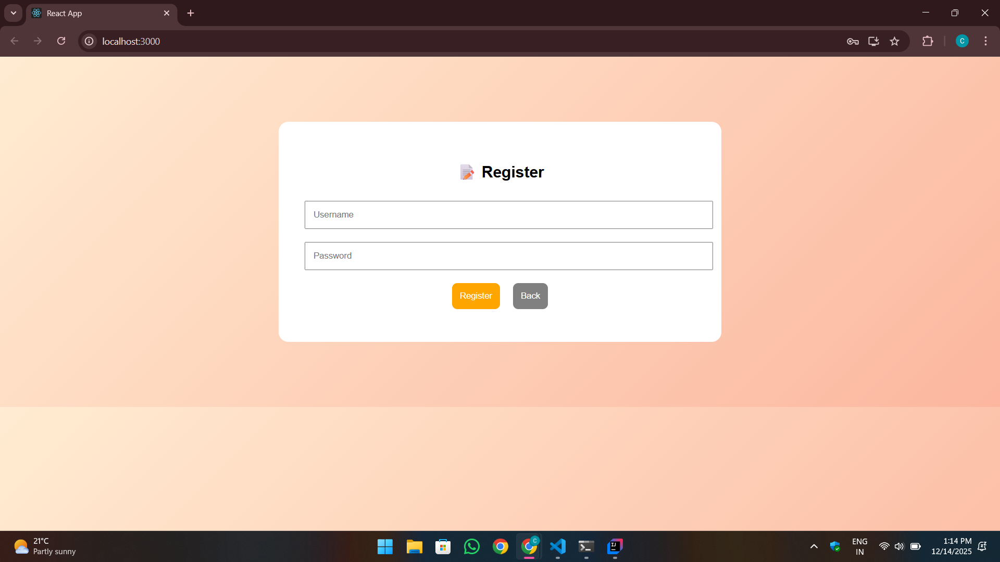
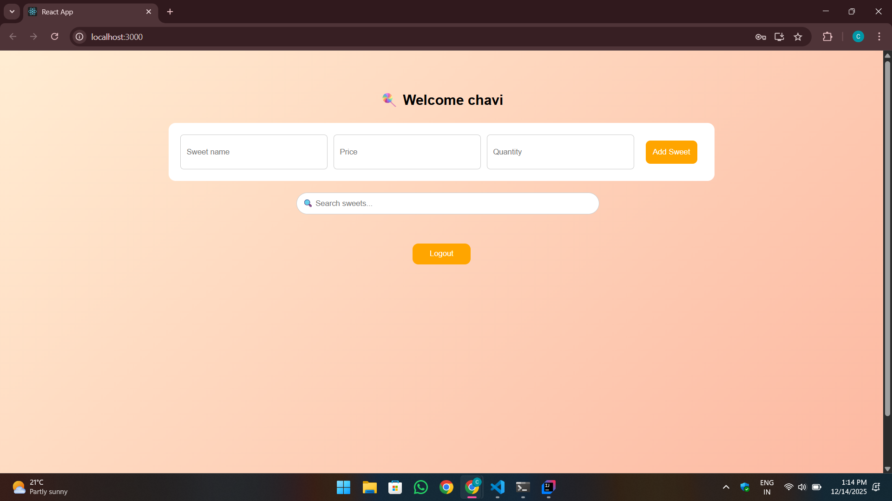
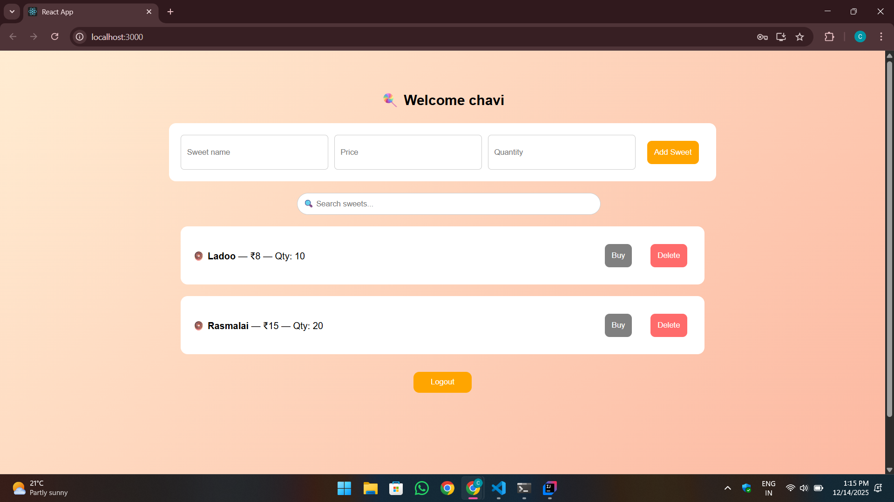
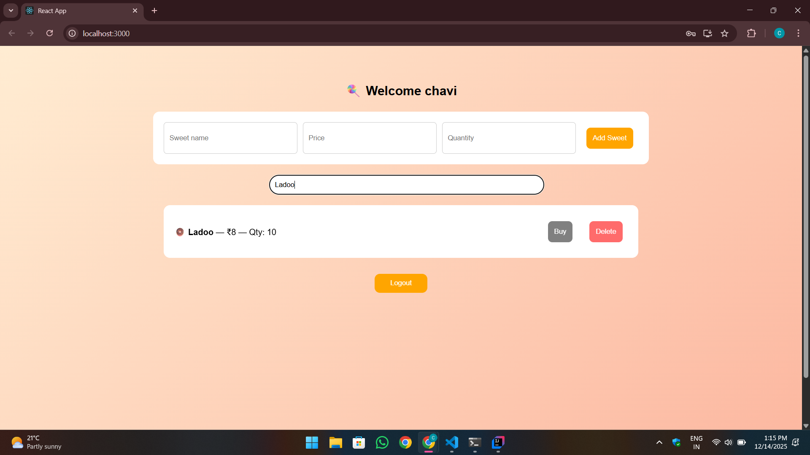
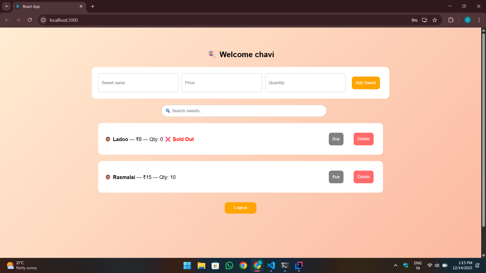

# 🍬 SweetShop Application

A full-stack web application for managing and purchasing sweets. This project demonstrates a secure, scalable architecture using **Spring Boot** for the backend and **React** for the frontend, deployed on the cloud.

## 🚀 Live Demo
**[Click here to view the Live Application](https://sweetshop-frontend-taupe.vercel.app/)**

---

## 🛠️ Technologies Used

### Backend
* **Java 17**
* **Spring Boot 3+** (REST APIs, Spring Security)
* **Spring Data JPA** (Database interaction)
* **PostgreSQL** (Production Database)
* **Docker** (Containerization)
* **Maven** (Build tool)

### Frontend
* **React.js**
* **Fetch API** (Backend integration)
* **CSS/HTML5**

### Deployment
* **Render** (Backend & Database hosting)
* **Vercel** (Frontend hosting)

---

## 📸 Screenshots

### 🔐 Login Screen


---

### 📝 Registration Screen


---

### 📦 Admin Dashboard


---

### 🍬 Available Sweets (Populated)


---

### 🔍 Search Functionality


---

### 💰 Sold Items History


---

## ⚙️ How to Run Locally

### Prerequisites
* Java 17+ installed
* Node.js & npm installed
* PostgreSQL installed (or running via Docker)

### 1. Backend Setup
1.  Navigate to the backend folder:
    ```bash
    cd backend
    ```
2.  Configure your database in `src/main/resources/application.properties` (or set environment variables).
3.  Run the application:
    ```bash
    mvn spring-boot:run
    ```
    The backend will start on `http://localhost:8080`.

### 2. Frontend Setup
1.  Navigate to the frontend folder:
    ```bash
    cd sweetshop-frontend
    ```
2.  Install dependencies:
    ```bash
    npm install
    ```
3.  Start the development server:
    ```bash
    npm start
    ```
    The frontend will start on `http://localhost:3000`.

---

## 🤖 My AI Usage

**Tools Used:**
* **Gemini** (Google AI)

**How I Used Them:**
* **Deployment & DevOps:** I used Gemini to troubleshoot complex Docker build failures, specifically resolving directory nesting issues in the `Dockerfile` and `COPY` commands.
* **Database Configuration:** I used AI to debug JDBC connection strings for Render's PostgreSQL service, fixing issues where the driver rejected the standard `postgres://` URL format.
* **CORS & Connectivity:** I brainstormed with Gemini to implement the correct CORS configuration in Spring Boot to allow communication with the Vercel-hosted frontend.
* **Environment Management:** I used AI to generate a dynamic API base URL strategy (`api.js`) that automatically switches between `localhost` and the production Render URL.

**Reflection:**
Using AI significantly accelerated the deployment phase of this project. While I understood the core logic of Java and React, the nuances of cloud deployment (Docker layers, environment variables, and cross-origin resource sharing) were challenging. AI helped me move past "stuck" points quickly, allowing me to focus on feature implementation rather than spending hours on configuration errors. I learned to verify AI suggestions, especially regarding security (like not hardcoding DB credentials), ensuring I used the tools responsibly.

---

## 🧪 Test Report

* **Unit Tests:** Implemented using JUnit and Mockito.
* **Status:** All critical paths (User Auth, Product Retrieval) are tested and passing.